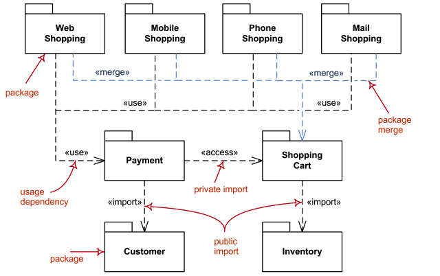

# UML

## Modelo 4 + 1

Es un modelo para describir la arquitectura de sistemas de software, basado en el uso de múltiples vistas concurrentes. 

Las vistas suelen describir el sistema desde el punto de vista de diferentes interesados, tales como usuarios finales, desarrolladores o directores de proyecto. Las cuatro vistas del modelo son: vista lógica, vista de desarrollo, vista de procesos y vista física. Además, una selección de casos de uso o escenarios suele utilizarse para ilustrar la arquitectura sirviendo como una vista más.

### Vista lógica

Describe la estructura y funcionalidad del sistema. Incluye los siguientes diagramas UML:

- [Diagrama de Clase](#diagrama-de-clase)
- [Diagrama de Objetos](#diagrama-de-objetos)
- [Diagrama de Estructura Compuesta](#diagrama-de-estructura-compuesta)
- [Diagramas de Interacción]() (Vistos en [Diseño de Aplicaciones 1](../../../../5/diseño-de-aplicaciones-1))

### Vista de desarrollo (o de componentes)

Describe el sistema desde la perspectiva de un programador. Está enfocada en la administración de los artefactos de software. Incluye los siguientes diagramas UML:

- [Diagrama de Componentes]()
- [Diagrama de Paquetes]()

### Vista de procesos

Describe los procesos del sistema y cómo se comunican entre sí. Está enfocada en el comportamiento del sistema en tiempo de ejecución. Incluye los siguientes diagramas UML:

- [Diagrama de Actividad]()

### Vista física (o de despliegue)

Describe el sistema desde la perspectiva de un ingeniero de sistemas. Está enfocada en la topología de componentes de software en la capa física, así como las conexiones físicas entre ellos. Incluye los siguientes diagramas UML:

- [Diagrama de Despliegue]()

### Escenarios

Describe el sistema desde la perspectiva exterior. Se utilizan [Casos de Uso]()

## Diagramas

http://www.uml-diagrams.org/uml-25-diagrams.html

### Diagrama de Clase

Muestra la estructura del sistema a nivel de clases e interfaces, enseñando sus características (métodos y propiedades), sus restricciones y sus relaciones (asociaciones, dependencias, generalizaciones, etc).

Más info: http://www.uml-diagrams.org/class-diagrams-overview.html

### Diagrama de Objetos

Representa una instancia específica de un diagrama de clases; muestra una "foto" del estado del sistema en un determinado momento en el tiempo.

Más info: http://www.uml-diagrams.org/class-diagrams-overview.html#object-diagram

### Diagrama de Estructura Compuesta

Mustra la estructura interna de una clase y/o las colaboraciones que la estructura hace posible.

Más info: http://www.uml-diagrams.org/composite-structure-diagrams.html

### Diagrama de Componentes

Muestra los componentes del sistema, junto con las interfaces que proveen y requieren, así como los puertos y relaciones entre ellos. Un **componente** representa un módulo que encapsula un sistema independiente. Los componentes pueden ser lógicos (por ejemplo un proceso de negocio determinado) o físicos (por ejemplo una librería de .NET o un jar de Java).

Más info: http://www.uml-diagrams.org/component-diagrams.html

### Diagrama de Paquetes

Muestra la estructura del sistema a nivel de paquetes.

Más info: http://www.uml-diagrams.org/package-diagrams-overview.html

## Diagrama de Actividad

Muestra un flujo de control enfatizando en la secuencia y condiciones de cada acción.

Más info: http://www.uml-diagrams.org/activity-diagrams.html

### Diagrama de Despliegue

Muestra la arquitectura del sistema como la distribución de los artefactos de software en los dispositivos a desplegar. Un **artefacto** representa un elemento concreto del mundo físico que es resultado de un proceso de desarrollo. Ejemplos de artefacto son archivos ejecutables (.exe), librerías (dll, so), archivos de configuración, archivos de recurso, bases de datos, etc.

Más info: http://www.uml-diagrams.org/deployment-diagrams-overview.html
