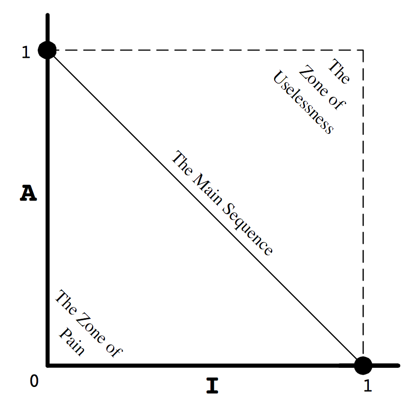

<h1 align="center">Métricas</h1>

Más info: https://aulas.ort.edu.uy/pluginfile.php/206903/course/section/37747/Principles_and_Patterns.pdf.

## Conceptos

* **Atributo**: Una propiedad medible que comparten todas las entidades de una misma categoría.

    Ejemplo: Defecto

* **Medida**: Resultado de una medición.

    Ejemplo: Número de defectos

* **Métrica**: Medida cuantitativa del grado en que un sistema posee un atributo dado. Es una forma de medir y una escala definida para realizar mediciones de uno a varios atributos.

    Ejemplo: Promedio de defectos por persona

## Categorías

- Orientadas a paquetes
- Orientadas a clases
- Orientadas a métodos

## Cohesión relacional

Mide la relación entre clases de un paquete

$$ \huge H = \frac{R + 1}{N} $$

> $ R $ = Cantidad de relaciones entre clases internas al paquete 
>
> $ N $ = Cantidad de clases e interfaces dentro del paquete.

Es buena si $ H $ está entre $ [1.5, 4.0] $

## Inestabilidad

$$ \huge I = \frac{C_e}{C_e + C_a} $$

> $ C_a $ = Cantidad de clases aferentes (Clases fuera del paquete que dependen de clases dentro del paquete).
>
> $ C_e $ = Cantidad de clases eferentes (Clases dentro del paquete que dependen de clases fuera del paquete)

Si $ I $ es $ 0 $ el paquete es estable, mientras que si $ I $ es $ 1 $ el paquete es inestable. Esto nos permite reescrbir el [SDP](../4/#sdp-stable-dependency-principle) como: **un paquete debe depender de paquetes cuya métrica $ I $ es menor que la propia**.

## Abstracción

$$ \huge A = \frac{N_a}{N_c} $$ 

> $ N_a $ = Cantidad de clases abstractas e interfaces del paquete
>
> $ N_c $ = Cantidad de clases concretas, abstractas e interfaces del paquete

Un paquete es abstracto en la medida que $ A $ tiende a $ 1 $. Esto nos permite reescribir el [SAP](../4/#sap-stable-abstractions-principle) como: **$ I $ debe crecer en la medida en que $ A $ decrece** (Paquetes concretos deberían ser inestables y paquetes abstractos deberían ser estables).

## Inestabilidad vs Abstracción

Queremos que nuestros paquetes estén lo más cerca posible de la línea *The Main Sequence*. Un posicionamiento en la línea indica que el paquete es abstracto en proporción a sus dependencias entrantes y es concreto en proporción a sus dependencias salientes. Esto deja un conjunto más de métricas a examinar: las [distancias](#distancia).

### Distancia

$$ D = \frac{A + I - 1}{\sqrt{2}} $$

Varía entre $ [0, ~0.707] $

### Distancia normalizada

$$ D' = | A + I - 1 | $$

Varía entre $ [0, 1] $. Si es $ 0 $ entonces el paquete está posicionado directamente en la línea *The Main Sequence*.

