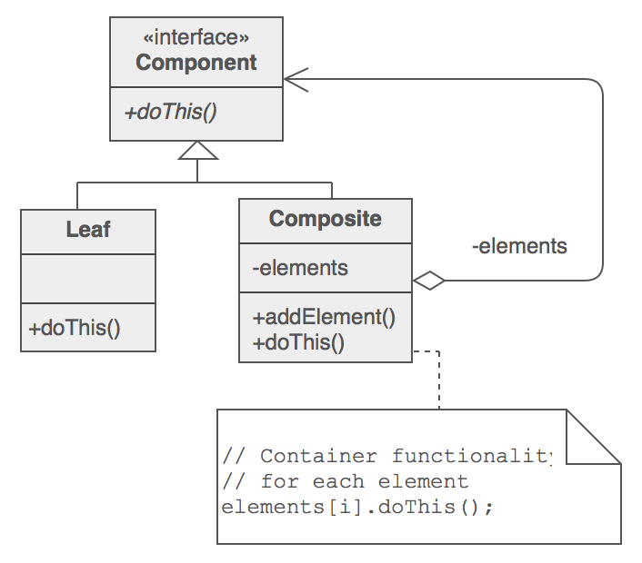
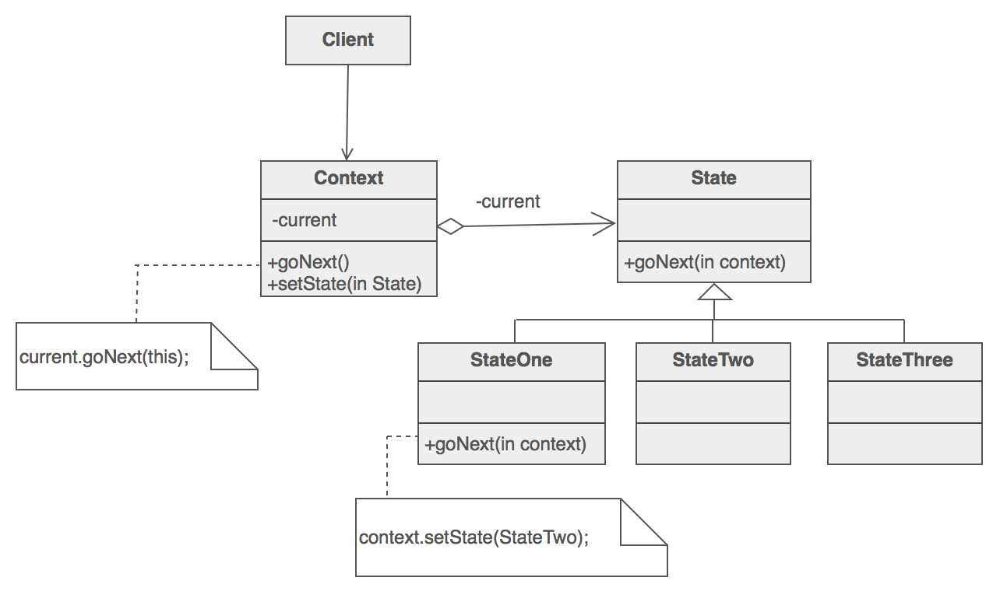
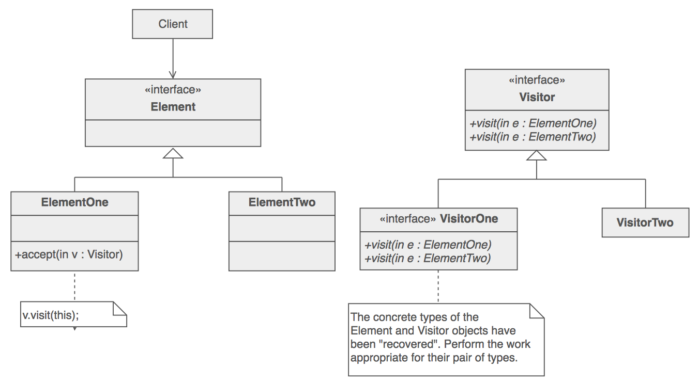

<h1 align="center">Patrones de Diseño</h1>

Más info: 

* https://github.com/kamranahmedse/design-patterns-for-humans#-proxy
* https://sourcemaking.com/design_patterns

## Abstract Factory

[[Patrón Creacional](https://sourcemaking.com/design_patterns/creational_patterns)]

**Definición coloquial**: Una fábrica de fábricas. Una fábrica que agrupa las fábricas individuales que están relacionadas sin especificar sus clases concretas.

**¿Cuándo usarlo?**: Cuando existen dependencias interrelacionadas que involucran lógicas de creación complejas.

### Diagrama

Más info: https://sourcemaking.com/design_patterns/abstract_factory

## Factory Method

[[Patrón Creacional](https://sourcemaking.com/design_patterns/creational_patterns)]

**Definición coloquial**: Define una interfaz para crear un objeto pero deja que las sub-clases decidan qué clase instanciar.

**¿Cuándo usarlo?**: Útil cuando hay un proceso genérico que decide que sub-clase de una clase es requerida. O en otras palabras, cuando el cliente no sabe en tiempo de ejecución exactamente qué sub-clase necesita.

### Diagrama

Más info: https://sourcemaking.com/design_patterns/factory_method

## Adapter

[[Patrón Estructural](https://sourcemaking.com/design_patterns/structural_patterns)]

**Definición coloquial**: Convierte la interfaz de una clase en otra que el cliente espera.

**¿Cuándo usarlo?**: Siempre que sea necesario. Es usualmente usado para mediar entre el sistema desarrollado y una librería de terceros de forma que el sistema quede desacoplado de la misma.

### Diagrama

Más info: https://sourcemaking.com/design_patterns/adapter

## Composite

[[Patrón Estructural](https://sourcemaking.com/design_patterns/structural_patterns)]

**Definición coloquial**: Permite a los clientes tratar objetos individuales y composiciones de objetos de manera uniforme.

### Diagrama

Más info: https://sourcemaking.com/design_patterns/composite

## Proxy

[[Patrón Estructural](https://sourcemaking.com/design_patterns/structural_patterns)]

**Definición coloquial**: Proporciona un sustituto para otro objeto con el propósito de controlar el acceso al mismo.

### Diagrama

Más info: https://sourcemaking.com/design_patterns/proxy

## Observer

[[Patrón de Comportamiento](https://sourcemaking.com/design_patterns/behavioral_patterns)]

**Definición coloquial**: Define una dependencia entre objetos de forma que siempre que un objeto cambia su estado, todos sus dependientes son notificados.

### Diagrama

Más info: https://sourcemaking.com/design_patterns/observer

## State

[[Patrón de Comportamiento](https://sourcemaking.com/design_patterns/behavioral_patterns)]

**Definición coloquial**: Permite cambiar el comportamiento de una clase dependiendo de su estado.

### Diagrama

Más info: https://sourcemaking.com/design_patterns/state

## Visitor

[[Patrón de Comportamiento](https://sourcemaking.com/design_patterns/behavioral_patterns)]

**Definición coloquial**: Permite agregar operaciones a un objeto sin tener que modificarlo.

### Diagrama

Más info: https://sourcemaking.com/design_patterns/visitor